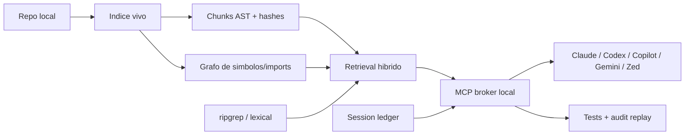

# NeuroFS - Anticipaciones estrategicas 2026

Ultima revision: 2026-05-27

## Tesis

Las grandes tecnologicas no estan compitiendo solo por tener "mejor chat de codigo". Estan construyendo una capa de control para agentes: indice vivo del repositorio, memoria de sesiones, subagentes especializados, permisos, ejecucion aislada, verificacion y billing integrado.

La posicion ganadora para NeuroFS no es convertirse en otro IDE. Es ser el plano local de contexto: una infraestructura abierta, auditable y model-agnostic que prepare el contexto correcto antes de que cualquier agente caro lo consuma.

## Senales externas

| Actor | Movimiento observado | Implicacion para NeuroFS |
|---|---|---|
| Cursor | Indices con Merkle trees, chunks sintacticos, cache de embeddings por contenido y reutilizacion segura de indices entre miembros de un equipo. Fuente: <https://cursor.com/blog/secure-codebase-indexing> | NeuroFS necesita pasar de "indice de archivos" a "indice de chunks con hashes", con recomputacion parcial y una historia clara de privacidad. |
| GitHub Copilot | Copilot cloud agent ya investiga, planifica y trabaja en ramas antes de abrir PR. VS Code anade busqueda semantica, grep remoto, prompt caching, deferred tool loading y memoria local tipo `/chronicle`. Fuentes: <https://github.blog/changelog/2026-04-01-research-plan-and-code-with-copilot-cloud-agent/> y <https://github.blog/changelog/2026-05-06-github-copilot-in-visual-studio-code-april-releases/> | El coste se reduce cargando menos herramientas y menos historia. NeuroFS debe ofrecer herramientas MCP quirurgicas y una memoria local propia. |
| GitHub Copilot app | Nueva app de escritorio GitHub-native para sesiones aisladas, desde issues/PRs/prompts/sesiones previas hasta review. Fuente: <https://github.blog/changelog/2026-05-14-github-copilot-app-is-now-available-in-technical-preview/> | Las sesiones de agente se estan convirtiendo en artefactos persistentes. NeuroFS debe capturar `task -> files -> tests -> decisiones -> bundle` como ledger local. |
| OpenAI Codex | Codex se mueve como plataforma multi-superficie: app, CLI, IDE, web y cloud sobre un harness comun; la app gestiona multiples agentes y tareas largas con sandbox configurable. Fuentes: <https://openai.com/index/introducing-the-codex-app/> y <https://openai.com/index/unlocking-the-codex-harness/> | Los agentes se desacoplaran del UI. NeuroFS debe ser consumible desde cualquier harness mediante MCP/JSON-RPC y no depender de un editor concreto. |
| Anthropic Claude Code | Subagentes con ventanas de contexto separadas, permisos por agente y hooks de ciclo de vida, incluidos cambios de fichero, compaction, worktrees y sesiones. Fuentes: <https://docs.anthropic.com/en/docs/claude-code/sub-agents> y <https://docs.anthropic.com/en/docs/claude-code/hooks> | La unidad de trabajo sera multiagente. NeuroFS debe proveer contexto pequeno y verificable para subagentes especializados, no solo bundles grandes para un chat principal. |
| Google Gemini | Google empuja MCP + Skills para conectar agentes a documentacion viva y patrones correctos; reporta 96.3% de pass rate y 63% menos tokens por respuesta correcta en su eval. Fuente: <https://blog.google/innovation-and-ai/technology/developers-tools/gemini-api-docsmcp-agent-skills/> | "Contexto + instrucciones operativas" gana a prompt plano. NeuroFS debe exportar contexto, reglas y skills/profiles para hosts diferentes. |
| Windsurf/Cognition | Fast Context/SWE-grep convierte la recuperacion de codigo en un subagente rapido que devuelve ficheros y rangos de lineas, con llamadas paralelas y menos polucion de contexto. Fuentes: <https://docs.windsurf.com/context-awareness/fast-context> y <https://cognition.ai/blog/swe-grep> | El siguiente rival de RAG no es solo vector search: es busqueda agentica rapida y verificable. NeuroFS debe combinar embeddings, `rg`, AST y grafo. |
| Zed | Editor abierto, multi-modelo, con agentes paralelos y soporte para agentes externos como Claude, Codex, Gemini CLI y Aider. Fuente: <https://zed.dev/docs/ai/overview> | El mercado se fragmenta por superficie, no por protocolo. NeuroFS gana si funciona igual en Zed, VS Code, Cursor, Claude Code, Codex y CLI. |

## Predicciones a 6-18 meses

1. **Los IDEs esconderan el indice y venderan "tiempo hasta primer agente".** Cursor ya explicita segundos frente a horas. La respuesta de NeuroFS debe ser un indice vivo, incremental y medible.
2. **La recuperacion sera hibrida.** Vector search seguira, pero los agentes usaran grep, AST, simbolos, historial y busqueda multi-turn. NeuroFS debe tratar `rg` y AST como ciudadanos de primera clase.
3. **Los proveedores reduciran herramientas visibles.** Tool bloat cuesta tokens y baja precision. La direccion probable es routers dinamicos, deferred loading y broker local.
4. **La memoria de trabajo sera producto.** `/chronicle`, CLAUDE.md, AGENTS.md, rules, skills y sesiones previas se convertiran en activos. NeuroFS debe tener un ledger local portable.
5. **El code review agentico sera un centro de coste.** GitHub ya empieza a vincular reviews con arquitectura agentica y consumo de infraestructura. NeuroFS puede venderse como reductor de contexto antes de CI/review.
6. **Los modelos pequenos se usaran para routing, pruning y retrieval.** El frontier model no deberia gastar tokens buscando. NeuroFS debe permitir SLM local opcional para descartar falsos positivos.
7. **La privacidad se convertira en diferenciador tecnico, no solo marketing.** Los equipos querran indices compartidos sin fuga de codigo. NeuroFS puede explorar simhash local y pruebas de posesion de contenido sin subir fuentes.

## Direccion estrategica

NeuroFS deberia evolucionar hacia un **Local Context Control Plane**:

El objetivo no es acumular mas contexto, sino seleccionar, comprimir, justificar y verificar el minimo suficiente.

## Contramovidas concretas

| Area | Movimiento competitivo probable | Respuesta NeuroFS |
|---|---|---|
| Indice | Merkle + chunks + cache compartida | Tabla `chunks`, hash por bloque, cache de embeddings por hash, root hash del repo. |
| Contexto | Busqueda semantica + grep + historial | Herramienta `neurofs_search` que devuelva rangos de lineas con razones: semantic, lexical, symbol, graph, changed. |
| Herramientas | Deferred tool loading y routers | `neurofs_context` como broker unico que decide si llama outline, signatures, excerpts, search o bundle, usando simbolos/imports locales como senal estructural auditable. |
| Memoria | Chronicle/rules/skills/sesiones | `.neurofs/ledger.jsonl` y exportadores a `AGENTS.md`, `CLAUDE.md`, reglas de Cursor/Windsurf y skills. |
| Multiagentes | Subagentes de busqueda, review, test | Perfiles de contexto: `research`, `build`, `review`, `test-fix`, cada uno con presupuesto y salida distinta. |
| Verificacion | Agentes que prueban y auto-fixean | Integrar resumen de test/lint y `audit replay` como outputs comprimidos para agentes. |
| Privacidad | Indices cloud con pruebas de acceso | Mantener local-first y disenar cache federada opcional con hashes, simhash y pruebas de posesion sin codigo fuente. |

## Lo que no deberia hacer NeuroFS

- No competir como IDE visual completo antes de que el motor sea claramente superior.
- No depender de un proveedor de embeddings o un modelo unico.
- No meter todo el grafo en el prompt; el grafo debe guiar seleccion, no inflar contexto.
- No convertir la memoria en una caja negra: cada recuerdo debe tener origen, fecha, archivos y uso esperado.
- No esconder las razones de inclusion. La auditabilidad es una ventaja frente a indices propietarios.

## Siguiente apuesta recomendada

La pieza de mayor apalancamiento en curso es **chunk hashing + retrieval hibrido**. Ya existe un primer `neurofs_search` con chunks persistidos, embeddings por `content_hash`, busqueda exacta con `rg`, expansion por grafo, prioridad al working set de git, penalizacion de chunks largos, medicion via `bench --search`, bundles directos por chunk con `pack --chunks`, prompts one-shot con `task --chunks`, un broker MCP `neurofs_context` con `structural_hints` desde simbolos/imports, perfiles `research/review/test/build` y medicion via `bench --context`; el siguiente tramo convierte esas metricas en decision de default:

1. Persistir chunks con `chunk_hash`, `content_hash`, line ranges, symbol, parent scope y representation hints.
2. Recalcular embeddings solo para chunks cuyo hash cambie.
3. Anadir un `neurofs_search` MCP que combine:
   - exact search con `rg` (implementado como `exact_content`);
   - simbolos/imports de SQLite;
   - similitud por embeddings (implementado);
   - expansion por grafo (implementado para imports directos);
   - cambios git (implementado como `working_set`);
   - salida en rangos citables.
4. Medir contra `neurofs_task`: latencia, tokens devueltos, recall de facts, estabilidad de cache y precision del routing.

Si esto funciona, NeuroFS se diferencia de Cursor/Copilot porque ofrece una capa recuperable por cualquier agente, no una ventaja encerrada dentro de un IDE.
